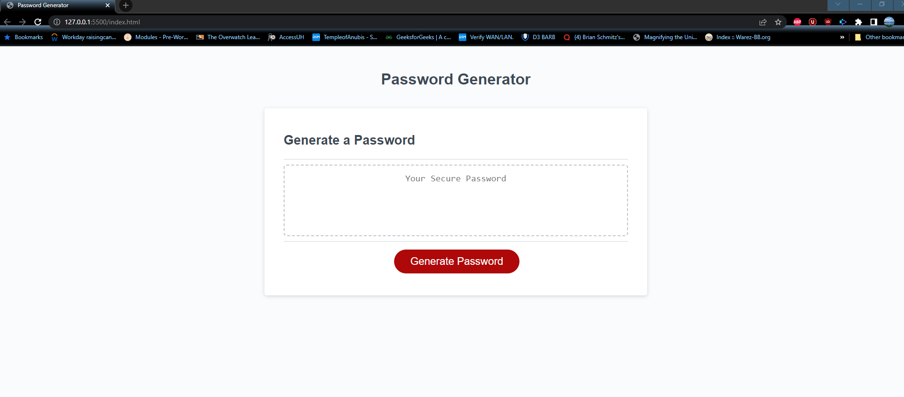
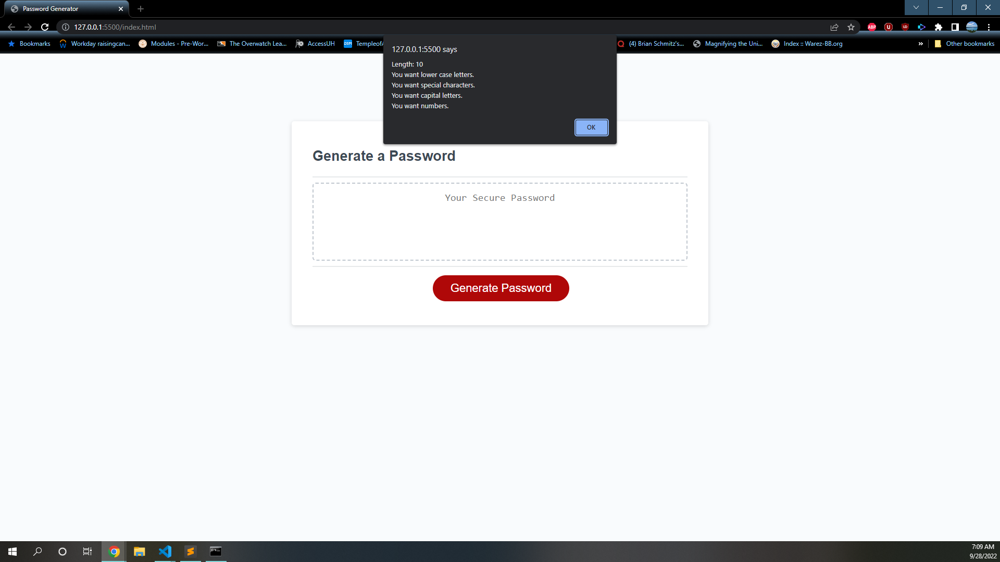
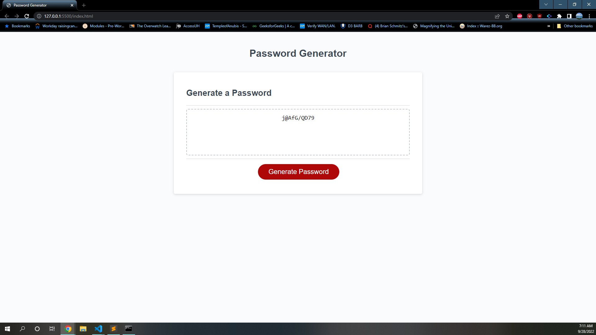
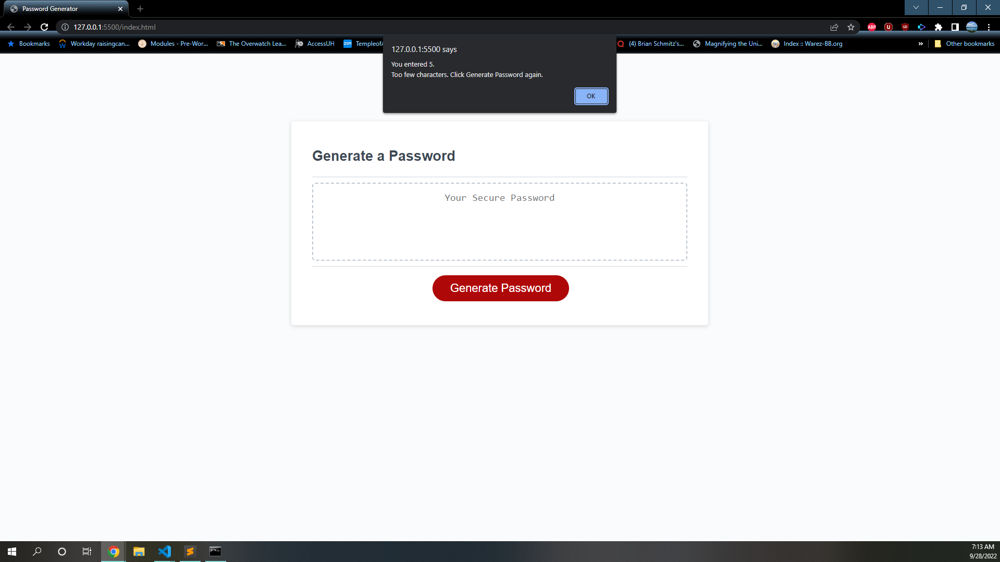
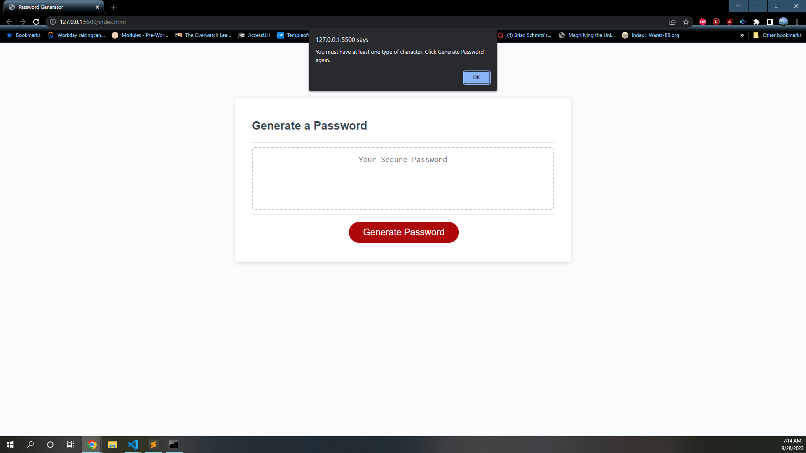

# challenge-3

## What does this do?
* This app generates a random password
* User inputs length
* User decides what type of characters they want
* Passwords must be between 8 and 128 characters

## User Error
* If the user enters a number less than 8 or more than 128 they are prompted to try again
* If the user does not select at least one type of character they are prompted to try again

## Screen Shots
Initial Screen

Confirmation Screen

Generated Password

User Length Error

User no Character Selection Error
